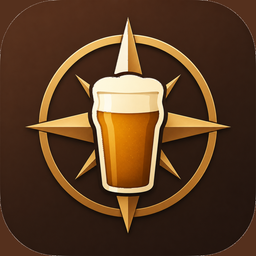
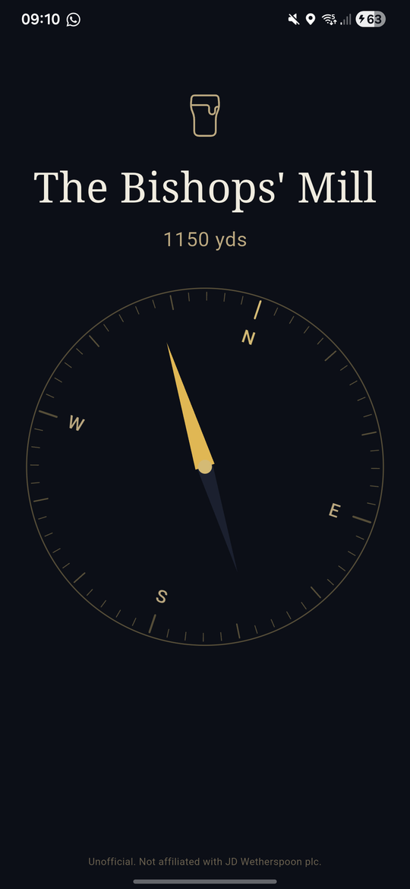
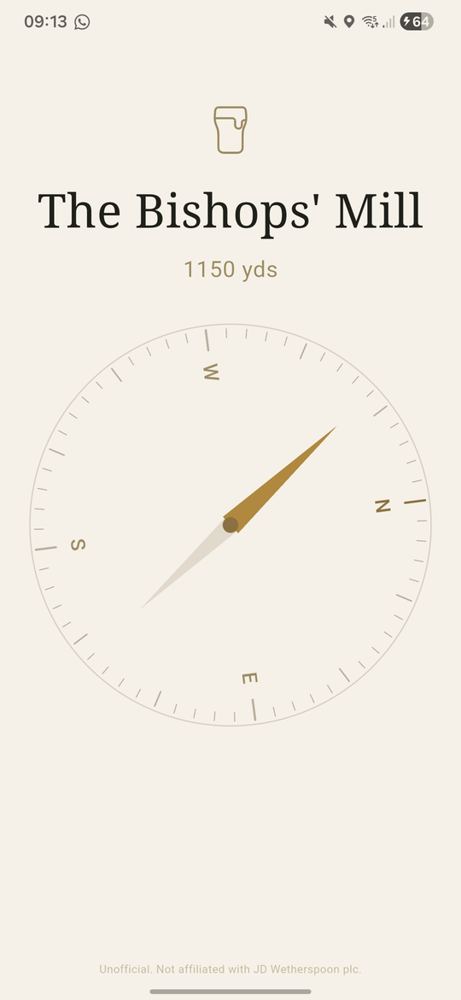

<div align="center">

  

<a name="readme-top"></a>

# Spoons Compass — Christian Garry

A pocket compass for thirsty walkers. Open the app; a gold needle points at your nearest **J D Wetherspoon pub**, with the distance shown below. No menus, no settings, no ads, no tracking, no account. The only control is *tap anywhere* to swap between dark and light mode.

<a name="internal-nav"></a>
### Contents
<p align="center">
  <a href="#intro">
    
  </a><br/>
  <a href="#install">
    
  </a><br/>
  <a href="#screenshots">
    
  </a><br/>
  <a href="#architecture">
    
  </a><br/>
  <a href="#build">
    
  </a><br/>
  <a href="#about">
    
  </a>
</p>


### Related Links

<!-- Row 1 -->
<p align="center">
  <a href="https://github.com/cgarryZA/Spoons-Compass/releases/latest/download/app-release.apk">
    
  </a>
  &nbsp;&nbsp;
  <a href="https://cgarryZA.github.io/Spoons-Compass/">
    
  </a>
  &nbsp;&nbsp;
  <a href="https://cgarryZA.github.io/Spoons-Compass/privacy.html">
    
  </a>
</p>

<!-- Row 2 -->
<p align="center">
  <a href="https://flutter.dev">
    
  </a>
  &nbsp;&nbsp;
  <a href="https://www.openstreetmap.org/">
    
  </a>
  &nbsp;&nbsp;
  <a href="https://en.wikipedia.org/wiki/J_D_Wetherspoon">
    
  </a>
</p>

</div>

> **Unofficial.** Not affiliated with, endorsed by, sponsored by, or in any way connected to **J D Wetherspoon plc**. "Wetherspoon" is a registered trademark of J D Wetherspoon plc, used here only descriptively.

This is the smallest possible app that answers the question *"Where is my nearest Spoons?"*. It was built as a single-screen, zero-button Flutter app, signed and published outside the Play Store via GitHub Releases.


<a name="intro"></a>
## Introduction
<a href="#readme-top"></a>

I wanted to know where the nearest Wetherspoons was, and the existing answer (Google Maps → type "Wetherspoons" → wait → parse the results) felt out of proportion to the problem. So I built this: open the app, a compass needle points at the nearest pub, the distance is shown underneath. That is the whole app.

The design rule was *no buttons*. The one exception is **tap anywhere on the screen** to toggle between dark and light mode — that preference then persists between launches via `SharedPreferences`. Otherwise it's a glance app: open, look, walk.

Pub locations are sourced from **OpenStreetMap** and bundled into the APK at build time. Everything runs locally — no network calls at runtime, no data sent off device.

<br>
<p align="center">
  
</p>
<br>


<a name="install"></a>
## Install on Android
<a href="#readme-top"></a>

The app is distributed as a signed `.apk` via GitHub Releases.

### One-tap install from your phone

Open the [landing page](https://cgarryZA.github.io/Spoons-Compass/) on your Android phone and tap the gold download button.

### Or use the direct APK URL

```text
https://github.com/cgarryZA/Spoons-Compass/releases/latest/download/app-release.apk
```

This URL always redirects to the most recent release, so you can share it without worrying about stale links.

### First-install permission flow

The first time you install an APK from a browser, Android will ask you to grant "install unknown apps" permission to that browser:

1. Open the downloaded APK from your notification shade.
2. Android: *"Allow Chrome to install unknown apps?"* → tap through to **Settings**, toggle it on, come back.
3. Tap **Install**.
4. Google Play Protect may say *"App not recognised by Play Protect"* — this is normal for any non-Play-Store app. Tap **Install anyway**.

After step 2, future installs from the same browser are one-tap.

---


<a name="screenshots"></a>
## Screenshots
<a href="#readme-top"></a>

<div align="center">

<table>
  <tr>
    <td align="center"></td>
    <td align="center"></td>
  </tr>
  <tr>
    <td align="center"><i>Dark mode (default)</i></td>
    <td align="center"><i>Light mode — tap to toggle</i></td>
  </tr>
</table>

</div>


<a name="architecture"></a>
## How It Works
<a href="#readme-top"></a>

The app is built around three streams feeding one widget:

1. **GPS stream** — [`geolocator`](https://pub.dev/packages/geolocator) emits a new `Position` whenever the phone moves more than 10 m, at high accuracy.
2. **Magnetometer stream** — [`flutter_compass`](https://pub.dev/packages/flutter_compass) emits the device's true heading (after Android's built-in sensor fusion) tens of times per second.
3. **Pub list** — `assets/pubs.json` is loaded once at startup; ~830 records sourced from OpenStreetMap.

On every frame, a `Ticker` interpolates the smoothed heading toward the latest sensor reading using **sin/cos averaging**, which handles the 359° → 1° wraparound cleanly. The compass dial rotates by `−heading` so the **N** tick always tracks true north; the needle rotates by `bearing − heading` so it independently points at the pub. The nearest pub is found by a linear scan over the bundled list using the Haversine distance formula.

Performance work was concentrated in three places:

- `RepaintBoundary` around the two rotating layers, so the rest of the screen never repaints when only the dial moves.
- The exponential smoothing constant, tuned empirically so the dial feels responsive but never twitches.
- Building in **release** mode (AOT-compiled Dart), not debug (JIT) — that change alone improved frame timing by ~5×.

No state management framework. No HTTP at runtime. No database. No analytics. The entire app is one `lib/main.dart` file.

### Tech stack

<div align="center">

| Layer | Tool |
|---|---|
| Framework | [Flutter 3.44](https://flutter.dev) |
| Language | Dart 3.12 |
| Location | [`geolocator`](https://pub.dev/packages/geolocator) |
| Compass | [`flutter_compass`](https://pub.dev/packages/flutter_compass) |
| Theme persistence | [`shared_preferences`](https://pub.dev/packages/shared_preferences) |
| Pub data | [OpenStreetMap Overpass API](https://overpass-turbo.eu/) |
| Build & sign | Gradle / `apksigner` |
| Hosting | [GitHub Pages](https://pages.github.com) + Releases |

</div>


<a name="build"></a>
## Build From Source
<a href="#readme-top"></a>

You'll need [Flutter](https://docs.flutter.dev/get-started/install) (3.44+) and either Android Studio or the standalone Android SDK `cmdline-tools` + JDK 17.

```bash
git clone https://github.com/cgarryZA/Spoons-Compass.git
cd Spoons-Compass
flutter pub get
flutter build apk --release
```

Output lands at `build/app/outputs/flutter-apk/app-release.apk`.

### Refreshing the pub list

The list of UK Wetherspoons changes over time. Re-pull the data from OpenStreetMap:

```bash
python tools/fetch_pubs.py
```

This queries Overpass for all nodes tagged `brand:wikidata=Q6109362` within the UK bounding box, writes them to `assets/pubs.json`, and warns if the count falls outside 700–1100 (a sanity-check on the API response).

### Regenerating the launcher icon

The launcher icon and Android adaptive variants are generated from `assets/icon.png`:

```bash
dart run flutter_launcher_icons
```


<a name="about"></a>
## About Me
<a href="#readme-top"></a>

I'm Christian Garry, a Graduate Communications Engineer at Siemens and an MSc student in **Scientific Computing and Data Analysis** at Durham University. I previously completed an **MEng in Electronic Engineering** at Durham.

This was a weekend Flutter project — the cleanest possible version of *"what's the smallest app that solves a real problem I have"*.

<div align="center">
  <a href="https://www.linkedin.com/in/christian-tt-garry/">
    
  </a>
  &nbsp;
  <a href="https://christiangarry.com">
    
  </a>
  &nbsp;
  <a href="https://github.com/cgarryZA">
    
  </a>
</div>

---

<p align="center"><i>Built with Flutter. Data from OpenStreetMap contributors. Pubs from <b>J D Wetherspoon plc</b>, who I assure you do not endorse this app.</i></p>
